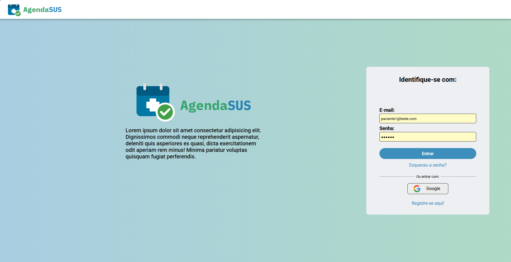
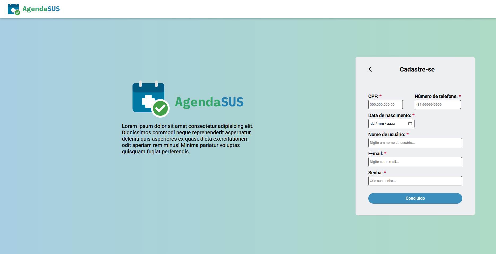
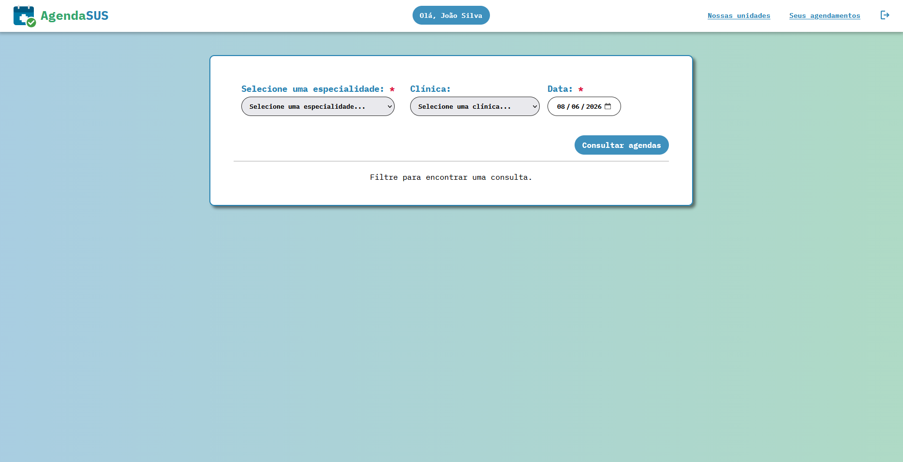
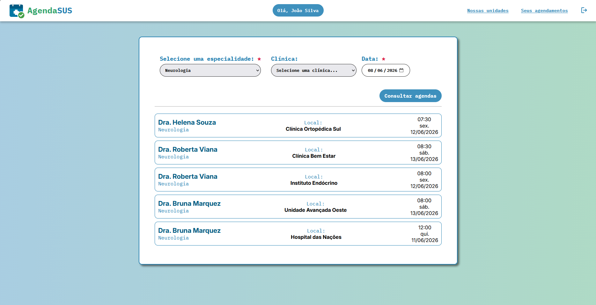
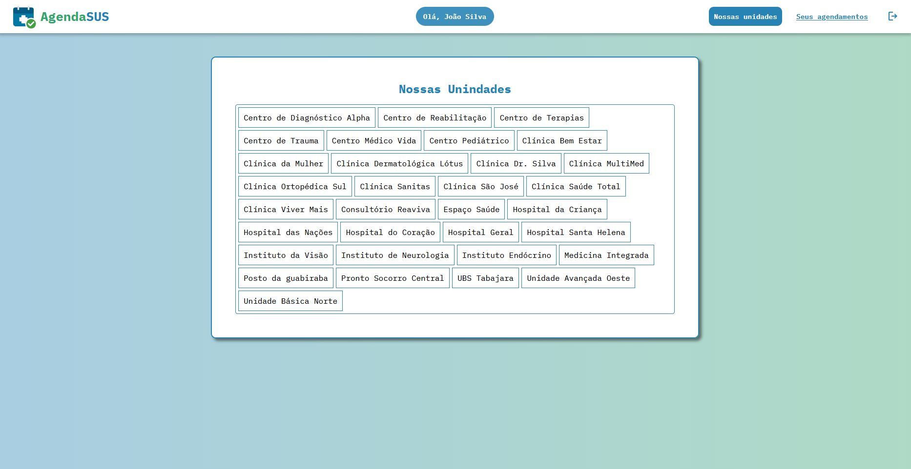

# Grupo (3o Período Noite)

- Rodrigo Nunes Peixoto Ramos
- Daniel Dantas de Farias
- Ericlys Severino da Silva
- Márcio José da Silva Morais Junior
- Othon Henrique Queiroz de Oliveira

# Agenda SUS

- Nosso propósito é facilitar a vida dos usuários da saúde pública na região. No site, é possível filtrar consultas, agendar, verificar as agendadas médicas e verificar as clínicas públicas na região metropolitana do Recife.

## Utilização

- **Linguagem:** Python
- **Framework/Biblioteca:** Flask / React
- **Banco de Dados:** MySQL
- **Ferramentas:** Docker / Git

## Setup do Projeto

1. Criar Virtual Env;

```bash
virtualenv <env_name>
```

2. Ative o ambiente virtual criado:

2.1 Linux/Mac:

```bash
source <env_name>/bin/activate
```

2.2 Windows:

```bash
<env_name>/bin/activate
```

3. Instale as dependências.

```bash
pip install -r requirements.txt
```

4. Rodando o projeto.

```bash
python app.py
```

## Funcionabilidades

-Login


-Cadastro


-Tela inicial


-Agendamento


-Nossas unidades


-Consultas agendadas

